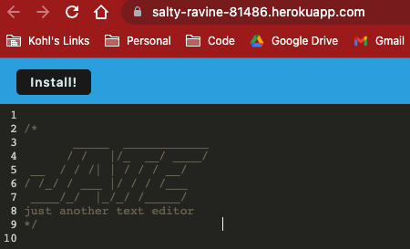

# PWA_Challenge
# Table of Contents

- [PWA\_Challenge](#pwa_challenge)
- [Table of Contents](#table-of-contents)
  - [Description of Project](#description-of-project)
  - [Installation Instructions](#installation-instructions)
  - [Usage Info](#usage-info)
  - [Contribution Guide](#contribution-guide)
  - [Test Instructions](#test-instructions)
  - [Questions](#questions)

## Description of Project  
  Progressive web application which is a text editor.  It uses index db to store data and allows for download of   

  Heroku deployment: https://salty-ravine-81486.herokuapp.com/ 

  

  ## Installation Instructions  
  the application for offline use.run npm i to get packages installed to run application.  When running application you will use npm start   

  ## Usage Info  
  dev.This is a simple text editor which has been set up to be a PWA. A simple index db will be used to store your data  

  ## Contribution Guide  
  None at this time  

  ## Test Instructions  
  please use npm start dev.  This will allow use in the dev enviroment while running npm start will build the PWA.  

  ## Questions  
  If you have other questions, feel free to connect via github at:
  https://gist.github.com/as-janosik  
  Otherwise you can reach me at the following email:
  andrew.janosik@gmail.com
